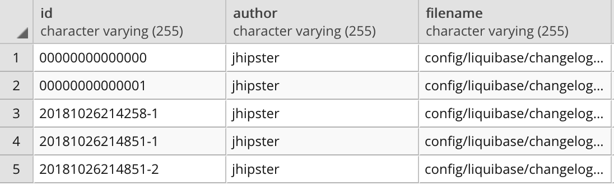
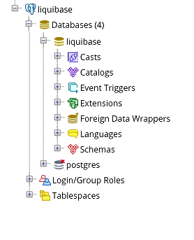
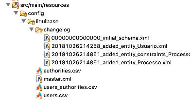
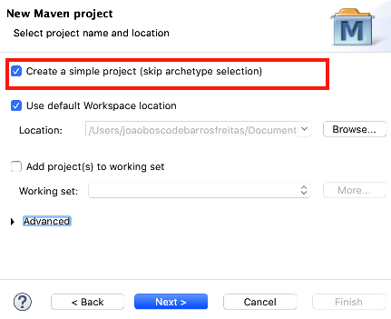

# Liquibase

O Liquibase é uma ferramenta de gerenciamento de versões em banco de dados. 

Ela permite que ao invés de escrever código SQL diretamente no banco de dados para criar, atualizar ou descartar objetos, 
os desenvolvedores podem definir as alterações desejadas no banco através de arquivos XML.

Qualquer alteração no banco de dados é agrupada em "ChangeSet".

::: :+1: Boa Prática :::

**Como boa prática use um `ChangeSet` para cada modificação no banco,
permitindo assim poder fazer um `rollback`, para uma versão anterior, facilmente.**
         


Alterações no banco de dados podem ser gerenciadas. Por exemplo, você pode marcar sua estrutura de banco de dados como um 
versão 1.0 (criando uma tag) após a primeira execução. 
Posteriormente, quando algumas correções forem feitas e a versão for atualizada para 1.1, 
você pode criar uma tag para  essas alterações feitas até o momento denominando-a, por exemplo de 1.1. 

Com a ajuda dessas tags, você pode reverter a estrutura do banco de dados de volta para uma determinada versão. 

::: :pushpin: Importante :::

> O liquibase gerencia versões das estruturas de um banco de dados, por exemplo
a criação de um novo índice ou a alteração do nome de uma coluna. O liquibase **não gerencia versões dos conteúdos** (dados) do banco.

## Conceitos Básicos

### ChangeSet 
> Ou  conjunto de mudanças é um agrupamento lógico de alterações no banco de dados. 
Por exemplo, um conjunto de mudanças pode ter operações para criar uma tabela, 
renomear uma coluna, adicionar uma chave estrangeira ou qualquer outra operação do banco de dados.

### Como o liquibase identifica um ChangeSet? 
> O changeset é identificado através de 3 elementos: id + autor + nome do arquivo de log de alterações (com caminho). 
Quando executar o liquibase pela primeira vez, ele irá criar 2 tabelas extras no seu banco de dados, 
`databasechangelog` e `databasechangeloglock`.

 


**Figura 1 - Conteúdo da tabela `databasechangelog`**


## Instalando o Postgresql

::: :walking: Passo a passo :::  
1. Instale o Postgresql para o seu SO : Mac, Linux ou Windows clicando no link 
(https://www.postgresql.org/download/)

2. Crie o banco de dados e o usuário

  - Abra um shell ou prompt do windows e digite

```SQL
$  postgresql/bin/psql -U postgres
Password for user postgres: senhaDoUsuarioPostgres
postgres=# create user liquibase;                                                                                                                                 CREATE ROLE
postgres=# create database liquibase with owner liquibase;
CREATE DATABASE
postgres=# alter user liquibase with encrypted password 'digiteSuaSenhaAqui';
ALTER ROLE
postgres=# grant all privileges on database liquibase to liquibase ;
GRANT
postgres=# \q
```
3. Instale o Pgadmin para o seu SO : Mac, Linux ou Windows clicando no link 
(https://www.pgadmin.org/download/)

4. Verifique se o pgadmin reconhece o seu novo banco de dados



**Figura 2- Imagem do pgadmin com o novo banco criado**  

## Criando um projeto Maven no Eclipse para usar o liquibase

Primeiro vamos criar um projeto maven no eclipse. Nesta demonstração não há classe java. Nós enfatizamos como usar o liquibase. A hierarquia do projeto de demonstração é semelhante à mostrada na Figura 3.



**Figura 3- Estrutura de um projeto liquibase**  

::: :walking: Passo a passo :::  

1. Abra o Eclipse e na pasta GrupoDeEstudo/Liquibase/Primo, crie um projeto Maven: File|New|Other|Maven Project

2. Crie um projeto simples (sem usar um arquétipo), Figura 4. 

<p align="center">
  
  <b>Figura 4- Criando um novo projeto Maven</b> 
</p>

**Figura 4- Criando um novo projeto Maven**  

3. Preencha os campos com:
```
groupId    : br.com.abim
artifactId : liquibase
version    : 0.1.0-SNAPSHOT
packaging  : jar
```

{: style="text-align:center"}
That is, while there is value in the items on
the right, we value the items on the left more.
