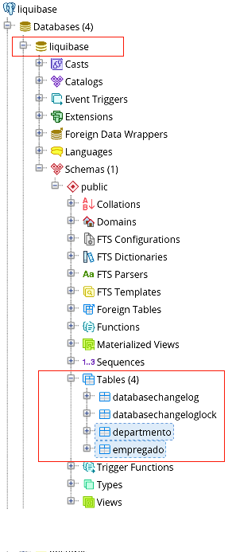
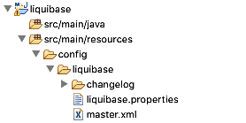

# Liquibase

O Liquibase é uma ferramenta de gerenciamento de versões em banco de dados. 

Ela permite que ao invés de escrever código SQL diretamente no banco de dados para criar, atualizar ou descartar objetos, 
os desenvolvedores possam definir as alterações desejadas no banco através de arquivos XML.

Isso é importante por que permite o versionamento da estrutura do banco. 

Qualquer alteração no banco de dados é agrupada em "ChangeSet".

::: :+1: Boa Prática :::

**Como boa prática use um `ChangeSet` para cada modificação no banco,
permitindo assim poder fazer um `rollback`, para uma versão anterior, facilmente.**
         

Alterações no banco de dados podem ser gerenciadas. Por exemplo, você pode marcar sua estrutura de banco de dados como um 
versão 1.0 (criando uma tag) após a primeira execução. 
Posteriormente, quando algumas correções forem feitas e a versão for atualizada para 1.1, 
você pode criar uma tag para  essas alterações feitas até o momento denominando-a, por exemplo de 1.1. 

Com a ajuda dessas tags, você pode reverter a estrutura do banco de dados de volta para uma determinada versão. 

::: :pushpin: Importante :::

> O liquibase gerencia versões das estruturas de um banco de dados, por exemplo
a criação de um novo índice ou a alteração do nome de uma coluna. O liquibase **não gerencia versões dos conteúdos** (dados) do banco.

## Conceitos Básicos

### ChangeSet 
> Também denominado de "conjunto de mudanças" é um agrupamento lógico de alterações no banco de dados. 
Por exemplo, um conjunto de mudanças pode ter operações para criar uma tabela, 
renomear uma coluna, adicionar uma chave estrangeira ou qualquer outra operação a ser realizada no banco de dados.

### Como o liquibase identifica um ChangeSet? 
> O changeset é identificado através de 3 elementos: id + autor + nome do arquivo de log de alterações (com caminho). 
Quando executar o liquibase pela primeira vez, ele irá criar 2 tabelas extras no seu banco de dados, 
`databasechangelog` e `databasechangeloglock`.

<p align="center">
  
</p>
<p align="center">
   <strong>Figura 1 - Conteúdo da tabela "databasechangelog"</strong> 
</p>


## Instalando o Postgresql

::: :walking: Passo a passo :::  
1. Instale o Postgresql para o seu SO : Mac, Linux ou Windows clicando no link 
(https://www.postgresql.org/download/)

2. Crie o banco de dados e o usuário

  - Abra um shell ou prompt do windows e digite

```SQL
$  postgresql/bin/psql -U postgres
Password for user postgres: senhaDoUsuarioPostgres
postgres=# create user liquibase;                                                                                                                                 CREATE ROLE
postgres=# create database liquibase with owner liquibase;
CREATE DATABASE
postgres=# alter user liquibase with encrypted password 'digiteSuaSenhaAqui';
ALTER ROLE
postgres=# grant all privileges on database liquibase to liquibase ;
GRANT
postgres=# \q
```
3. Instale o Pgadmin para o seu SO : Mac, Linux ou Windows clicando no link 
(https://www.pgadmin.org/download/)

4. Execute o `pgadmin` e verifique se o novo banco de dados (denominado `liquibase`), foi realmente criado.

<p align="center">
  
</p>
<p align="center">
   <strong>Figura 2- Imagem do pgadmin com o novo banco criado</strong> 
</p>

## Criando um projeto Maven no Eclipse para usar o liquibase

Primeiro vamos criar um projeto maven no eclipse. Nesta demonstração não há classe java, pois o nosso objetivo é dar ênfase em como usar o liquibase. 

A hierarquia do projeto de demonstração é semelhante à mostrada na Figura 3.

<p align="center">
  
</p>
<p align="center">
   <strong>Figura 3- Estrutura de um projeto liquibase</strong> 
</p>

::: :walking: Passo a passo :::  

1. Abra o Eclipse e na pasta GrupoDeEstudo/Liquibase/Primo, crie um projeto Maven: File|New|Other|Maven Project

2. Crie um projeto simples (sem usar um arquétipo), Figura 4. 

<p align="center">
  
</p>
<p align="center">
   <strong>Figura 4- Criando um novo projeto Maven</strong> 
</p>


3. Preencha os campos com:
```
groupId    : br.com.abim
artifactId : liquibase
version    : 0.1.0-SNAPSHOT
packaging  : jar
```
4. Altere o arquivo `pom.xml` conforme abaixo:

```xml
<project xmlns="http://maven.apache.org/POM/4.0.0"
	xmlns:xsi="http://www.w3.org/2001/XMLSchema-instance"
	xsi:schemaLocation="http://maven.apache.org/POM/4.0.0 http://maven.apache.org/xsd/maven-4.0.0.xsd">
	<modelVersion>4.0.0</modelVersion>

	<groupId>br.com.abim</groupId>
	<artifactId>liquibase</artifactId>
	<version>0.1.0-SNAPSHOT</version>
	<packaging>jar</packaging>

	<name>liquibase</name>
	<url>http://maven.apache.org</url>

	<properties>
		<project.build.sourceEncoding>UTF-8</project.build.sourceEncoding>
	</properties>

	<dependencies>
		<!-- Dependências do Postgresql -->
		<dependency>
			<groupId>org.postgresql</groupId>
			<artifactId>postgresql</artifactId>
			<version>9.4-1203-jdbc42</version>
		</dependency>
	</dependencies>

	<build>
		<finalName>liquibase-demo</finalName>
		<plugins>
			<!-- Usar o Java 8 -->
			<plugin>
				<groupId>org.apache.maven.plugins</groupId>
				<artifactId>maven-compiler-plugin</artifactId>
				<version>2.5.1</version>
				<configuration>
					<source>1.8</source>
					<target>1.8</target>
				</configuration>
			</plugin>

			<!-- Plugin do liquibase  -->
			<plugin>
				<groupId>org.liquibase</groupId>
				<artifactId>liquibase-maven-plugin</artifactId>
				<version>3.4.2</version>
				<configuration>
					<propertyFile>liquibase/liquibase.properties</propertyFile>
					<changeLogFile>liquibase/db-changelog-master.xml</changeLogFile>
				</configuration>
			</plugin>
		</plugins>
	</build>

</project>

```
::: :pushpin: Importante :::

> Preste atenção nas configurações abaixo:

```
				<configuration>
					<propertyFile>liquibase/liquibase.properties</propertyFile>
					<changeLogFile>liquibase/db-changelog-master.xml</changeLogFile>
				</configuration>

```
> Você está informando ao Maven para ler os 2 arquivos de propriedades (recursos) que estão na pasta `liquibase`. Portanto essa pasta precisa ser criada. 

5. Crie a pasta  `liquibase` dentro da pasta `src\main\resources\config`. 

6. Nessa pasta recém criada, crie o arquivo `liquibase.properties` com o seguinte conteúdo:

```
# Postgresql
driver=org.postgresql.Driver
url=jdbc:postgresql://localhost:5432/liquibase 
username=liquibase
password=aquiSuaSenha
```
::: :pushpin: Importante :::

> Não deixe nenhum espaço em branco no final de cada linha


7. Na mesma pasta, crie tambémo arquivo `db-changelog-master.xml` com o seguinte conteúdo:

```xml
<databaseChangeLog
	xmlns="http://www.liquibase.org/xml/ns/dbchangelog"
	xmlns:xsi="http://www.w3.org/2001/XMLSchema-instance"
	xsi:schemaLocation="http://www.liquibase.org/xml/ns/dbchangelog
                        http://www.liquibase.org/xml/ns/dbchangelog/dbchangelog-3.4.xsd">


	<changeSet id="cria_departmento" author="jbbf">
		<createTable tableName="departamento">
			<column name="id" type="bigint"
				autoIncrement="${autoIncrement}">
				<constraints primaryKey="true" nullable="false" />
			</column>
			<column name="nome" type="varchar(50)">
				<constraints nullable="false" />
			</column>
		</createTable>
	</changeSet>

	<changeSet id="cria_empregado" author="jbbf">
		<createTable tableName="empregado">
			<column name="id" type="int">
				<constraints primaryKey="true" nullable="false" />
			</column>
			<column name="nome_empregado" type="varchar(50)">
				<constraints nullable="false" />
			</column>
			<column name="dept" type="int" />
		</createTable>
	</changeSet>

	<changeSet id="tag-1.0" author="jbbf">
		<tagDatabase tag="1.0" />
	</changeSet>

</databaseChangeLog>

```
8. Execute o comando `mvn liquibase:update` 

9. Certifique-se de que as tabelas foram criadas 

<p align="center">
  
</p>
<p align="center">
   <strong>Figura 5- Banco de Dados na Versão 1.0</strong> 
</p>

## Criando mais um campo  na tabela Departamento  e criando uma `constraint`


Vamos então aproveitar essa oportunidade para fazer quatro coisas:
- Criar um novo campo na tabela para armazenar a uf 
- Criar uma chave estrangeira na tabela empregado, indicando o seu departamento
- Criar tags para as versões do banco
- Criar um `changelog` denominado `master.xml` que incluirá os demais arquivo `changelog`

::: :walking: Passo a passo :::  

1. Altere a estrutura de pastas do seu projeto para que fique igual à da Figura 6

<p align="center">
  
</p>
<p align="center">
   <strong>Figura 6- Nova estrutura de pastas</strong> 
</p>

2. Renomeie o changelog `db-changelog-master.xml`para `esquemaInicial.xml`. 

3. Grave o changelog `esquemaInicial.xml` na pasta `changelog` recém criada.

4. Agora vamos corrigir o nome da tabela `departmento` para `departamento`. Para isso crie um `changelog` denominado `corrigeTabelaDepartamento.xml` e grave-o na pasta `changelog`. O arquivo terá o seguinte conteúdo:

```xml
<databaseChangeLog
	xmlns="http://www.liquibase.org/xml/ns/dbchangelog"
	xmlns:xsi="http://www.w3.org/2001/XMLSchema-instance"
	xsi:schemaLocation="http://www.liquibase.org/xml/ns/dbchangelog
                        http://www.liquibase.org/xml/ns/dbchangelog/dbchangelog-3.4.xsd">

	<changeSet author="jbbf" id="exclui_departmento">
		<dropTable cascadeConstraints="true" schemaName="public"
			tableName="departmento" />
	</changeSet>
	<changeSet id="cria_departamento" author="jbbf">
		<createTable tableName="departamento">
			<column name="id" type="bigint"
				autoIncrement="${autoIncrement}">
				<constraints primaryKey="true" nullable="false" />
			</column>
			<column name="nome" type="varchar(50)">
				<constraints nullable="false" />
			</column>
		</createTable>
	</changeSet>

	<changeSet id="tag-1.1" author="jbbf">
		<tagDatabase tag="1.1" />
	</changeSet>

</databaseChangeLog>
```
::: :pushpin: Importante :::

> Observe que tivemos que excluir a tabela `departmento` para depois criar uma nova como o nome correto. Essa é a tag 1.1

5. Agora vamos criar a chave estrangeira na tabela `empregado` referenciando a tabela `departamento`. Para isso crie um  changelog denominado `criaConstraintEmpregado.xml` e grave-o na pasta `changelog`. O arquivo terá o seguinte conteúdo:

```xml
<databaseChangeLog
	xmlns="http://www.liquibase.org/xml/ns/dbchangelog"
	xmlns:xsi="http://www.w3.org/2001/XMLSchema-instance"
	xsi:schemaLocation="http://www.liquibase.org/xml/ns/dbchangelog
                        http://www.liquibase.org/xml/ns/dbchangelog/dbchangelog-3.4.xsd">

	<changeSet id="cria_coluna_departamento_id" author="jbbf">
		<addColumn  schemaName="public" tableName="empregado">
			<column name="departamento_id" type="bigint" />
		</addColumn>
	</changeSet>


	<changeSet author="jbbf" id="cria_contraints_empregado">
		<addForeignKeyConstraint
			baseColumnNames="departamento_id" baseTableName="empregado"
			constraintName="fk_departamento" referencedColumnNames="id"
			referencedTableName="departamento" />
	</changeSet>

	<changeSet id="tag-1.2" author="jbbf">
		<tagDatabase tag="1.2" />
	</changeSet>

</databaseChangeLog>
```
::: :pushpin: Importante :::

> Observe que o primeiro `changeset` cria a coluna `departamento_id`  na tabela `empregado` e o segundo cria a chave estrangeira que tem como `referenceTableName` a tabela `departmento`. Essa é a tag 1.2

6. Por fim  vamos criar um `changelog` denominado `master.xml` que incluirá os demais arquivos changelog usando a tag `include`. Esse arquivo deverá ser gravado na pasta `liquibase` e conterá o seguinte conteúdo:

```xml
<?xml version="1.0" encoding="utf-8"?>
<databaseChangeLog
    xmlns="http://www.liquibase.org/xml/ns/dbchangelog"
    xmlns:xsi="http://www.w3.org/2001/XMLSchema-instance"
    xsi:schemaLocation="http://www.liquibase.org/xml/ns/dbchangelog http://www.liquibase.org/xml/ns/dbchangelog/dbchangelog-3.5.xsd">
    <include file="config/liquibase/changelog/esquemaInicial.xml" relativeToChangelogFile="false"/>
    <include file="config/liquibase/changelog/corrigeTabelaDepartamento.xml" relativeToChangelogFile="false"/>
    <include file="config/liquibase/changelog/criaConstraintEmpregado.xml" relativeToChangelogFile="false"/>
</databaseChangeLog>
```
7. Altere o arquivo `pom.xml` 

de:
```xml
<propertyFile>liquibase/liquibase.properties</propertyFile>
<changeLogFile>liquibase/db-changelog-master.xml</changeLogFile>
```
para: 
```xml
<propertyFile>config/liquibase/liquibase.properties</propertyFile>
<changeLogFile>config/liquibase/master.xml</changeLogFile>
```

8. Como houve mudança de pastas do arquivo `changelog` inicial, precisaremos fazer um `drop cascade` nas tabelas criadas, usando o `pgadmin`.

9. Após executar o `drop cascade`, execute o comando `mvn liquibase:update`. 

10. Pronto!

#### Desafio 1 :innocent:
 
```
- Volte para a tag 1.0 usando goal liquibase:rollback (pesquise a sintaxe correta)
- Usando o pgadmin, verifique o conteúdo do arquivo databasechangelog
- Avance para a tag 1.2
- Usando o pgadmin, verifique o conteúdo do arquivo databasechangelog
```

> Tudo funcionou como esperado?

#### Desafio 2 :innocent:
 
```
- Usando o liquibase, povoe as as tabelas `empregado` e `departamento`, usando um arquivo `.csv` 
```


